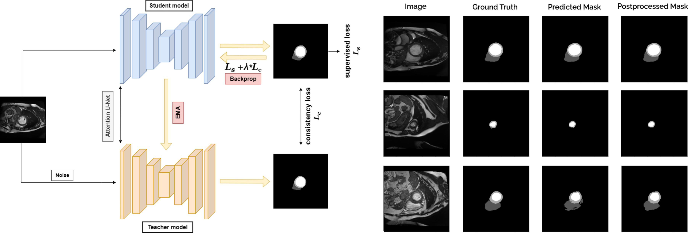

# Semi-Supervised Approach For Cardiac Medical Image Segmentation

A deep learning project for cardiac MRI image segmentation using U-Net architecture with both supervised and semi-supervised learning approaches.

## Overview

This project implements a medical image segmentation system using U-Net architecture with attention mechanisms. It's designed for cardiac MRI image segmentation tasks and supports both supervised and semi-supervised learning approaches. The implementation includes:



- Base U-Net architecture
- Attention U-Net variant
- Combined Cross-Entropy and Dice loss
- Data augmentation and preprocessing
- Training and validation pipelines
- Progress tracking and visualization

## Features

- **Multiple Architectures**: Implementation of both standard U-Net and Attention U-Net
- **Flexible Training**: Support for both supervised and semi-supervised learning
- **Advanced Loss Functions**: Combined Cross-Entropy and Dice loss for better segmentation
- **Data Augmentation**: Built-in support for data augmentation and preprocessing
- **Progress Tracking**: Real-time training progress visualization
- **GPU Support**: Automatic GPU utilization when available

## Requirements

- Python 3.6+
- PyTorch
- torchvision
- numpy
- opencv-python
- matplotlib
- torchmetrics

## Installation

1. Clone the repository:
```bash
git clone https://github.com/FFarhangian/semi-supervised-cardiac-image-segmentation.git
cd semi-supervised-cardiac-image-segmentation
```

2. Install the required packages:
```bash
pip install -r requirements.txt
```

## Project Structure

```
├── mainSegmentationChallenge.ipynb    # Main training notebook
├── ssl.ipynb                         # Semi-supervised learning notebook
├── UNet_Base.py                      # Base U-Net implementation
├── UNet_Attention.py                 # Attention U-Net implementation
├── medicalDataLoader.py              # Data loading utilities
├── losses.py                         # Loss function implementations
├── utils.py                          # Utility functions
└── progressBar.py                    # Progress bar implementation
```

## Usage

1. Prepare your dataset in the following structure:
```
Data/
├── train/
│   ├── images/
│   └── masks/
├── val/
│   ├── images/
│   └── masks/
└── test/
    ├── images/
    └── masks/
```

2. For supervised learning, run the main notebook:
```bash
jupyter notebook mainSegmentationChallenge.ipynb
```

3. For semi-supervised learning, run:
```bash
jupyter notebook ssl.ipynb
```

## Training Parameters

The model can be configured with the following parameters:
- Batch size: 8 (default)
- Learning rate: 0.001 (default)
- Weight decay: 1e-5 (default)
- Number of epochs: 200 (default)
- Number of classes: 4 (default)

## Model Architecture

The project implements two variants of the U-Net architecture:

1. **Base U-Net**: Standard U-Net implementation with encoder-decoder structure
2. **Attention U-Net**: Enhanced version with attention gates for better feature selection

## Acknowledgments

- Original U-Net paper: [U-Net: Convolutional Networks for Biomedical Image Segmentation](https://arxiv.org/abs/1505.04597)
- Attention U-Net paper: [Attention U-Net: Learning Where to Look for the Pancreas](https://arxiv.org/abs/1804.03999)
